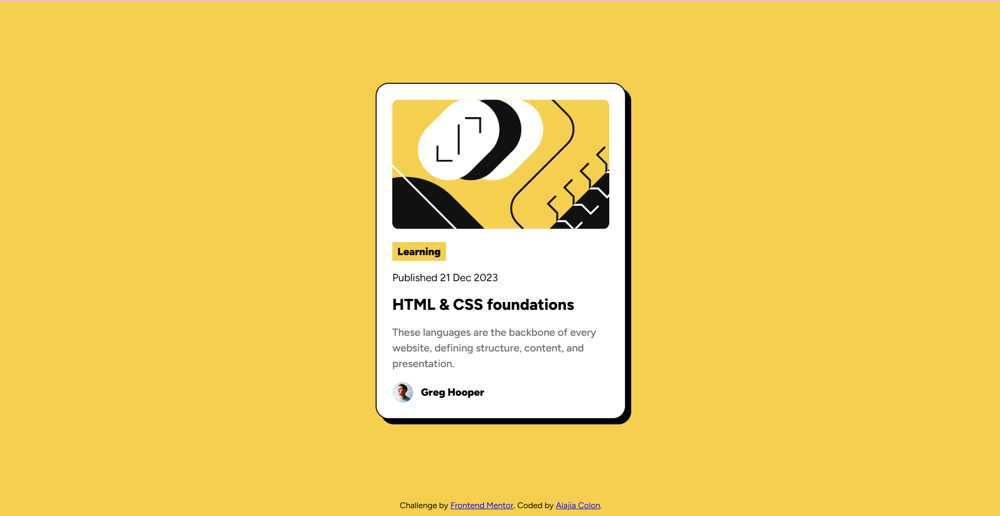

# Frontend Mentor - Blog preview card solution

This is a solution to the [Blog preview card challenge on Frontend Mentor](https://www.frontendmentor.io/challenges/blog-preview-card-ckPaj01IcS). Frontend Mentor challenges help you improve your coding skills by building realistic projects. 

## Table of contents

- [Frontend Mentor - Blog preview card solution](#frontend-mentor---blog-preview-card-solution)
  - [Table of contents](#table-of-contents)
  - [Overview](#overview)
    - [The challenge](#the-challenge)
    - [Screenshot](#screenshot)
    - [Links](#links)
  - [My process](#my-process)
    - [Built with](#built-with)
    - [What I learned](#what-i-learned)
    - [Continued development](#continued-development)
    - [AI Collaboration](#ai-collaboration)
  - [Author](#author)

**Note: Delete this note and update the table of contents based on what sections you keep.**

## Overview

### The challenge

Users should be able to:

- See hover and focus states for all interactive elements on the page

### Screenshot

### Links

- Solution URL: [GitHub Repository](https://github.com/alajiacolon/blog-preview-card)
- Live Site URL: [Preview Page](https://alajiacolon.github.io/blog-preview-card/)

## My process

### Built with

- Semantic HTML5 markup
- CSS custom properties
- Flexbox

### What I learned

This project helped me understand how semantic HTML5 elements make a page’s structure clearer. I practiced choosing elements based on their purpose, such as using `<main>` for the page’s primary content, `<article>` for the blog card, and a heading and paragraphs for the text. This makes the markup easier to read and can also help assistive technologies understand the page.

I also learned more about using CSS Flexbox to arrange and align elements. I used a flex layout to center the card within the page and to place the author’s image and name side by side. Practicing properties such as `display: flex`, `justify-content`, `align-items`, and `gap` helped me see how Flexbox can control layout without relying on fixed positioning.

### Continued development

In future projects, I’d like to build my mobile-first development skills. I plan to start by creating a layout that works well on small screens, then add responsive adjustments for wider screens as needed. I also want to get more practice using flexible widths, spacing, and images so content adapts naturally instead of depending on fixed dimensions. Testing at several viewport sizes will help me catch layout issues early and make sure the experience remains clear and comfortable on both phones and desktops.

### AI Collaboration

I used ChatGPT as a senior mentor and developer to ask questions when I got stuck, understand possible approaches, and get guidance as I worked through the project. I used GitHub Copilot to generate boilerplate, answer quick questions, and help make code changes. These tools helped me keep moving while learning, and I reviewed the suggestions and used them to build my understanding of the HTML and CSS in the project.

## Author

- Frontend Mentor - [@alajiacolon](https://www.frontendmentor.io/profile/alajiacolon)
